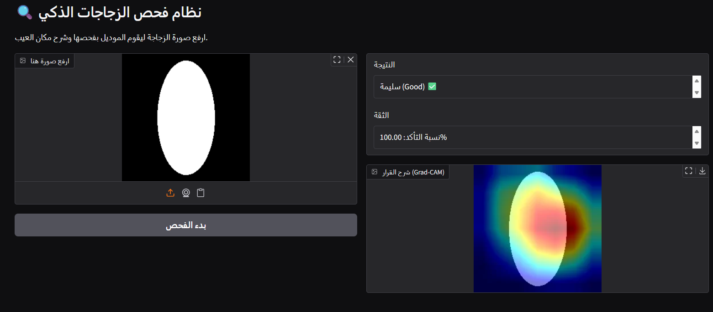

# Grad-CAM
# Explainable Defect Classification with Grad-CAM

## Project Overview
This project implements an automated, deep learning-based quality control system for manufacturing. Traditional Convolutional Neural Networks (CNNs) act as "black boxes." To build trust in AI decisions, this project integrates **Grad-CAM** (Gradient-weighted Class Activation Mapping) to visually explain the model's predictions by highlighting the exact location of surface defects (e.g., scratches, contamination) on industrial bottles.

Features & Deliverables
1. **Binary Classification:** Accurately classifies bottles as `Good` or `Defective`.
2. **Explainability (XAI):** Generates instant heatmaps over the original image to prove *why* the model made its decision.
3. **Interactive Web App:** Deployed a user-friendly UI using **Gradio** for real-time inference by quality inspectors.
4. **Ablation Study:** Conducted experiments on hyperparameter sensitivity (Learning Rate).

Visual Results (Grad-CAM)

The model successfully localizes the artificial defects. Below is a comparison between a normal sample and a defective sample with its corresponding Grad-CAM heatmap:

| Normal Bottle (Good) ✅ | Defective Bottle (Grad-CAM) ❌ |
| :---: | :---: |
|  |  |

System Architecture & Methodology
* **Dataset:** A synthetic dataset of 200 bottle images (100 Good / 100 Defective), inspired by the MVTec Anomaly Detection dataset.
* **Model Backbone:** **ResNet-34** (Pre-trained on ImageNet). The final Fully Connected (FC) layer was modified for binary classification.
* **Optimization:** Adam Optimizer, Cross-Entropy Loss, trained for 10 Epochs.
* **XAI Target Layer:** `model.layer4[-1]` (The last convolutional layer before pooling).

Ablation Study: Learning Rate Sensitivity

To evaluate model stability, an ablation study was conducted by altering the learning rate ($LR$):
* **Baseline (LR = 0.0001$):** Stable training. The model achieved high accuracy (>90%) and Grad-CAM successfully localized defects.
* **Experiment (LR = 0.1$):** Extreme instability (Overshooting). The model failed to converge, resulting in random guessing and meaningless heatmaps.
* **Conclusion:** Fine-tuning pre-trained models (like ResNet) requires exceptionally small learning rates to preserve existing feature extractors.

**Training Convergence (Loss Curve):**

## How to Run
1. Open the notebook call (Grad-CAM.ipynb) in github.
2. Run all cells to generate synthetic data and train the model.
3. The Grad-CAM visualization will appear at the end.

## Results
The model achieved >90% accuracy, and Grad-CAM successfully localized the defects.
